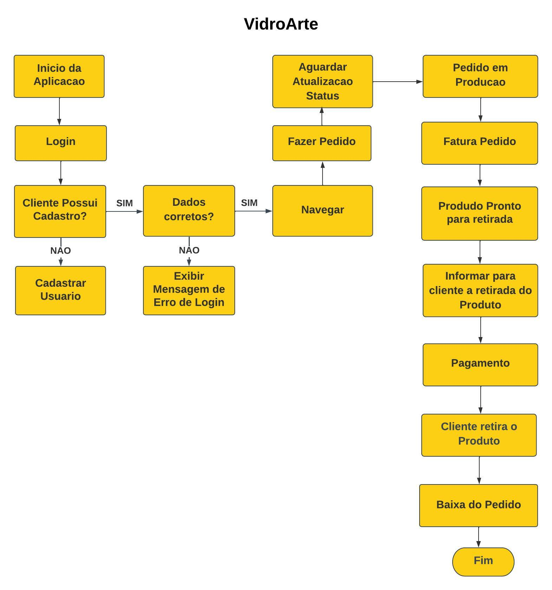

# Projeto de Interface

Dentre as diretrizes para a montagem da interface, estamos focando
 em questões como agilidade e usuabilidade. Desta forma, o projeto tem
uma identidade visual padronizada.

## Diagrama de Fluxo

O diagrama apresenta o estudo do fluxo de interação do usuário com o sistema interativo e  muitas vezes sem a necessidade do desenho do design das telas da interface. Isso permite que o design das interações seja bem planejado e gere impacto na qualidade no design do wireframe interativo que será desenvolvido logo em seguida.

## Wireframes                                                                                                                                                                                                                                                                                                                                                                                                      
Conforme o diagrama de fluxo do projeto, apresentado no item anterior, as telas do sistema
são apresentadas em detalhes nos itens que se seguem. Para visualizar o wireframe
interativo, acesse o ambiente MarvelApp seguindo pelo link --> https://marvelapp.com/prototype/1982i90j.                                                                           
Nesta estrutura, existem 3 grandes blocos, descritos a seguir. São eles:                                                                                                                                                                                                                                                                                                     
● Cabeçalho - local onde são dispostos elementos fixos de identidade (logo) e
navegação principal do site (menu da aplicação);                                                                                                                                                                                                                                                                                                   
● Conteúdo - apresenta o conteúdo da tela em questão;                                                                                                                                                                                                                                                                                                                   
                                                                        
