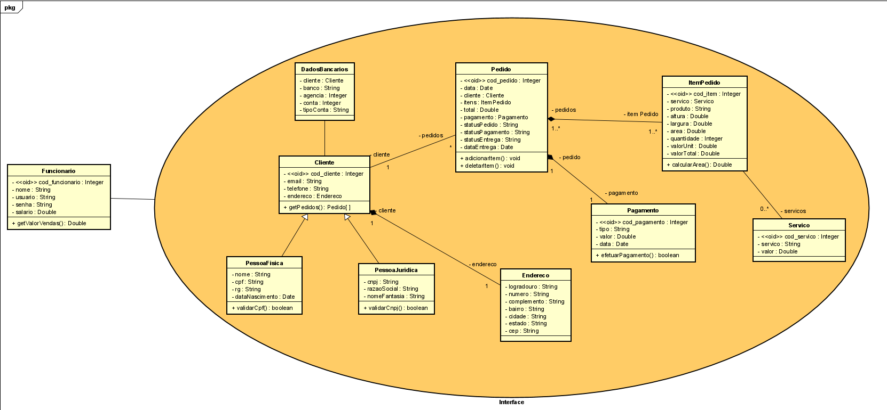

# Arquitetura da Solução

Neste tópico iremos tratar sobre a parte técnica da solução desenvolvida pela equipe, apresentando os componentes que fazem parte do sistema e do ambiente de hospedagem.

## Diagrama de Classes

O diagrama de classes ilustra graficamente como será a estrutura do software, e como cada uma das classes da sua estrutura estarão interligadas. Essas classes servem de modelo para materializar os objetos que executarão na memória.

## Modelo ER (Projeto Conceitual)

O Modelo ER representa através de um diagrama como as entidades (coisas, objetos) se relacionam entre si na aplicação interativa.

Ferramenta para geração deste artefato: LucidChart.

## Projeto da Base de Dados

O projeto da base de dados corresponde à representação das entidades e relacionamentos identificadas no Modelo ER, no formato de tabelas, com colunas e chaves primárias/estrangeiras necessárias para representar corretamente as restrições de integridade.
 

## Tecnologias Utilizadas

- Linguagens utlizadas no desenvolvimento da solução: HTML, CSS, JavaScript
- IDEs de desenvolvimento: Visual Studio
- Plataforma para hospedagem do site: Azure
- Plataforma para hospedagem dos arquivos: Google Drive
- Ferramenta de versionamento: Git
- Ferramenta para a criação de logo e imagens: Canvas e Photoshop

## Hospedagem

Como ambiente de hospedagem do site do projeto optamos pela plataforma GitHub Pages. A publicação foi realizada por comandos via git para o repositório que pode ser acessado através do endereço:.

